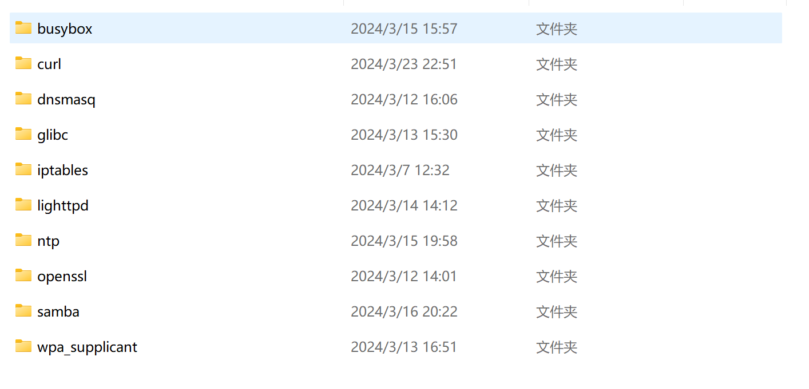
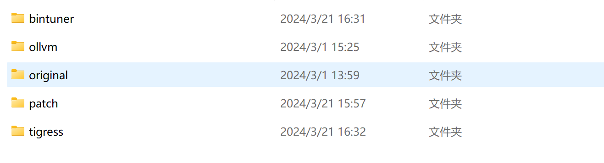
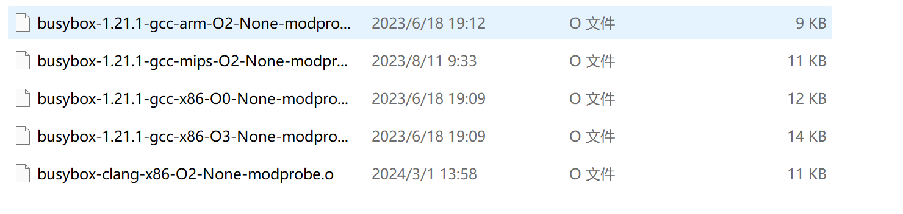
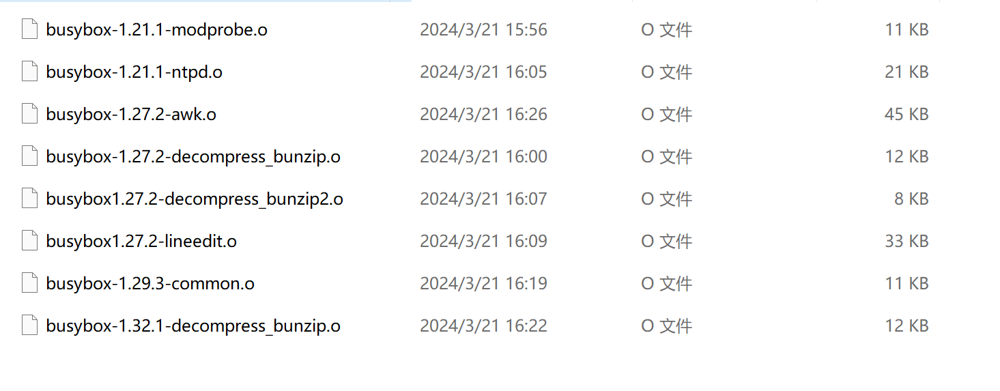

Our dataset is composed of three parts: vul, tpcs-s, and tpcs-l.

 In the vul part, there are 10 libraries containing a total of 100 CVE vulnerabilities. 

Each vulnerability consists of five types of data: original (including multiple architectures, compilers, and optimizations), ollvm (obfuscated using the ollvm obfuscator), tigress (obfuscated using the Tigress obfuscator), bintuner (created using the Bintuner tool), and patch (the patched version of the vulnerability).

Tpcs-s and tpcs-l, as search pools of different sizes, were compared in the context of gcc-x86-O2.

